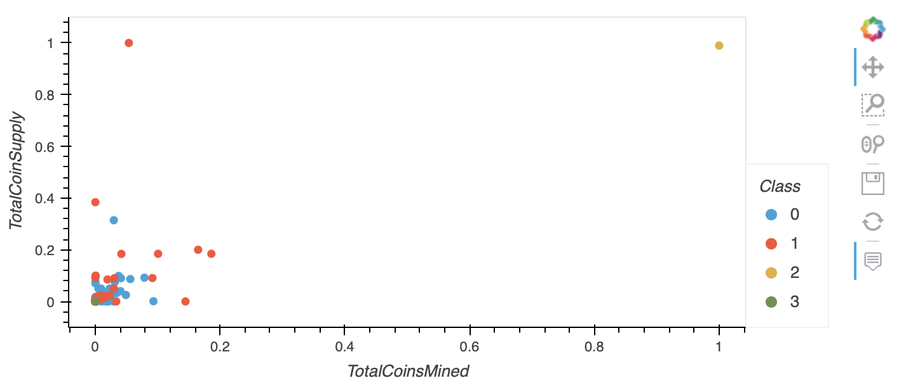
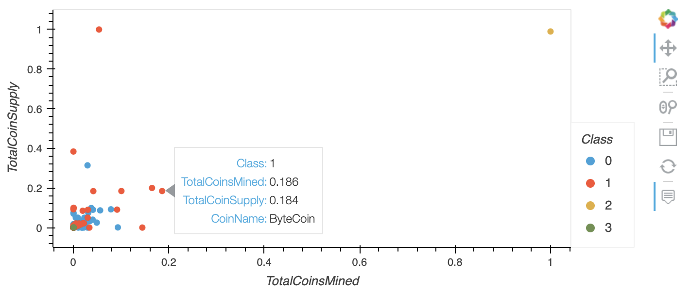

# Cryptocurrencies

## Overview
We have used unsupervised learning to analyze cryptocurrency market data. Accountability Accounting, a prominent investment bank, has an interested in offering a new cryptocurrency investment portfolio for its customers. They’ve asked us to create a report that includes what cryptocurrencies are on the trading market and how they could be grouped together to create a classification system for a new investment. The data were preprocessed processed to fit the machine learning models. To group the cryptocurrencies, a clustering algorithms was used that included an initial Principal Component Analysis (PCA) before K-Means Clustering was used for clustering.

**Tools Used:**
- Python, Pandas
- Scikit Learn
  - Preprocessing
  - PCA
  - KMeans Clustering
- Imbalanced-learn
- Git

## Results

## Summary

