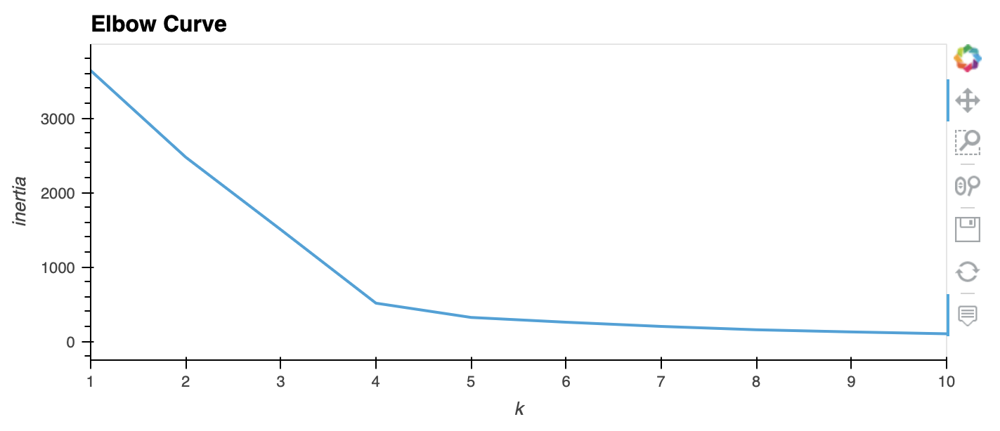

# Cryptocurrencies

## Overview
We have used unsupervised learning to analyze cryptocurrency market data. Accountability Accounting, a prominent investment bank, has an interested in offering a new cryptocurrency investment portfolio for its customers. They’ve asked us to create a report that includes what cryptocurrencies are on the trading market and how they could be grouped together to create a classification system for a new investment. The data were preprocessed processed to fit the machine learning models. To group the cryptocurrencies, a clustering algorithms was used that included an initial Principal Component Analysis (PCA) before K-Means Clustering was used for clustering.

**Tools Used:**
- Python, Pandas
- Scikit Learn
  - Preprocessing
  - PCA
  - K-Means Clustering
- Imbalanced-learn
- Git

## Method

- Imported to Pandas data frames (from csv files) and created crypto_df
- Kept all the cryptocurrencies that are being traded
- Dropped the IsTrading column
- Removed rows that have at least one null value
- Filtered the crypto_df DataFrame so it only has rows where coins have been mined
- Created a new DataFrame that holds only the cryptocurrency names, and used the crypto_df DataFrame index as the index for this new DataFrame
- Removed the CoinName column from the crypto_df DataFrame
- For Algorithm and Proof columns, dummy variables were created, and a new data frame X was created
- Data were standardized
- PCA was performed and a new data frame was created with the first 3 principal components
- The best k value for K-Means clustering was determined by using Elbow curve
- K-Means clustering model was created using k = 4 and PCA components
- A data table was created with tradable Cryptocurrencies

## Results

**Cleaned Data table of Cryptocurrencies**

**PCA 3D Scatter Plot**

**3 Components of PCA** 

**Elbow curve to determine optimal k**

**Combined table with the 3 PC of PCA**

**Scatter Plot of Tradable Cryptocurrencies Colored by the K Clusters**

**ScatterPlot of Tradable Cryptocurrencies Colored by the K Clusters (hovered on a data point to show details)*

## Summary

We have created data frames, cleaned up data, standardadized data for further analysis. PCA and subsequent K-Means clustering on the 3 PC components in PCA was performed on pre-processed data. We found 4 clusters of Cryptocurrencies.  

